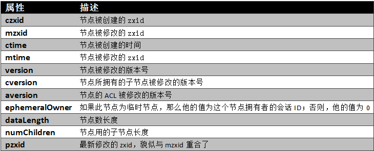

#Zookeeper源码分析(1)

##源码阅读前需要知道的基础知识

### Zookeeper中的节点类型

ZooKeeper目录树中每一个节点对应一个Znode。每个Znode维护着一个属性结构，它包含着版本号(dataVersion)，时间戳(ctime,mtime)等状态信息。ZooKeeper正是使用节点的这些特性来实现它的某些特定功能。每当Znode的数据改变时，他相应的版本号将会增加。每当客户端检索数据时，它将同时检索数据的版本号。并且如果一个客户端执行了某个节点的更新或删除操作，他也必须提供要被操作的数据版本号。如果所提供的数据版本号与实际不匹配，那么这个操作将会失败。
Znode是客户端访问ZooKeeper的主要实体，它包含以下几个特征：
1. Watches
客户端可以在节点上设置watch(我们称之为监视器)。当节点状态发生改变时(数据的增、删、改)将会触发watch所对应的操作。当watch被触发时，ZooKeeper将会向客户端发送且仅发送一条通知，因为watch只能被触发一次。
2. 数据访问
ZooKeeper中的每个节点存储的数据要被原子性的操作。也就是说读操作将获取与节点相关的所有数据，写操作也将替换掉节点的所有数据。另外，每一个节点都拥有自己的ACL(访问控制列表)，这个列表规定了用户的权限，即限定了特定用户对目标节点可以执行的操作。
3. 节点类型
ZooKeeper中的节点有两种，分别为临时节点和永久节点。节点的类型在创建时即被确定，并且不能改变。
　　ZooKeeper的临时节点：该节点的生命周期依赖于创建它们的会话。一旦会话结束，临时节点将被自动删除，当然可以也可以手动删除。另外，需要注意是，ZooKeeper的临时节点不允许拥有子节点。
　　ZooKeeper的永久节点：该节点的生命周期不依赖于会话，并且只有在客户端显示执行删除操作的时候，他们才能被删除。
4. 顺序节点（唯一性的保证）
当创建Znode的时候，用户可以请求在ZooKeeper的路径结尾添加一个递增的计数。这个计数对于此节点的父节点来说是唯一的，它的格式为“%10d”(10位数字，没有数值的数位用0补充，例如“0000000001”)。当计数值大于232-1时，计数器将溢出。
org.apache.zookeeper.CreateMode中定义了四种节点类型，分别对应：
PERSISTENT：永久节点
EPHEMERAL：临时节点
PERSISTENT_SEQUENTIAL：永久节点、序列化
EPHEMERAL_SEQUENTIAL：临时节点、序列化

### Zookeeper中的时间

ZooKeeper有多种记录时间的形式，其中包含以下几个主要属性：
1. Zxid
致使ZooKeeper节点状态改变的每一个操作都将使节点接收到一个zxid格式的时间戳，并且这个时间戳全局有序。也就是说，也就是说，每个对节点的改变都将产生一个唯一的zxid。如果zxid1的值小于zxid2的值，那么zxid1所对应的事件发生在zxid2所对应的事件之前。实际上，ZooKeeper的每个节点维护者三个zxid值，为别为：cZxid、mZxid、pZxid。
cZxid： 是节点的创建时间所对应的Zxid格式时间戳。
mZxid：是节点的修改时间所对应的Zxid格式时间戳。
实现中zxid是一个64为的数字，它高32位是epoch用来标识leader关系是否改变，每次一个leader被选出来，它都会有一个 新的epoch。低32位是个递增计数。
2. 版本号
对节点的每一个操作都将致使这个节点的版本号增加。每个节点维护着三个版本号，他们分别为：
version 节点数据版本号
cversion 子节点版本号
aversion 节点所拥有的ACL版本号

* tickTime:单位ms,默认3000

1. 用于指定session检查的间隔,服务器会每隔一段时间检查一次连接它的客户端的session是否过期。该间隔就是tickTime。

2. 用于给出默认的minSessionTimeout和maxSessionTimeout,如果没有给出maxSessionTimeout和minSessionTimeout（为-1），则minSessionTimeout和maxSessionTimeout的取值如下：
minSessionTimeout == -1 ? tickTime 2 : minSessionTimeout; maxSessionTimeout == -1 ? tickTime 20 : maxSessionTimeout;
分别是tickTime的2倍和20倍。

### 节点的属性结构

* datadir:

ZooKeeper有两类数据要存储。一种就是事务记录，另一种就是ZooKeeper的内存树中的数据,以快照方式存储。 所以可以给这两种数据指定不同的目录。dataDir用来指定内存树快照的存储位置，dataLogDir用来指定事务记录的存储位置。只给出了dataDir的目录，则代表两种数据都存储在该目录下。

### Znode总结

1. znode中的数据可以有多个版本，在查询该znode数据时就需要带上版本信息。如：set path version / delete path version
2. znode可以是临时znode，由create -e 生成的节点，一旦创建这个znode的client与server断开连接，该znode将被自动删除。
client和server之间通过heartbeat来确认连接正常，这种状态称之为session，断开连接后session失效。
3. 临时znode不能有子znode。
4. znode可以自动编号，由create -s 生成的节点，例如在 create -s /app/node 已存在时，将会生成 /app/node00***001节点。
5. znode可以被监控，该目录下某些信息的修改，例如节点数据、子节点变化等，可以主动通知监控注册的client。事实上，通过这个特性，可以完成许多重要应用，例如配置管理、信息同步、分布式锁等等。

##Zookeeper启动

服务端启动脚本是

    bin/zkServer.sh start

看脚本，发现ZOOMAIN是启动程序的入口，其类是：

    org.apache.zookeeper.server.quorum.QuorumPeerMain

主函数如下：

    public static void main(String[] args) {
        QuorumPeerMain main = new QuorumPeerMain();
        try {
            main.initializeAndRun(args);
        } catch (IllegalArgumentException e) {
            LOG.error("Invalid arguments, exiting abnormally", e);
            LOG.info(USAGE);
            System.err.println(USAGE);
            System.exit(2);
        } catch (ConfigException e) {
            LOG.error("Invalid config, exiting abnormally", e);
            System.err.println("Invalid config, exiting abnormally");
            System.exit(2);
        } catch (DatadirException e) {
            LOG.error("Unable to access datadir, exiting abnormally", e);
            System.err.println("Unable to access datadir, exiting abnormally");
            System.exit(3);
        } catch (AdminServerException e) {
            LOG.error("Unable to start AdminServer, exiting abnormally", e);
            System.err.println("Unable to start AdminServer, exiting abnormally");
            System.exit(4);
        } catch (Exception e) {
            LOG.error("Unexpected exception, exiting abnormally", e);
            System.exit(1);
        }
        LOG.info("Exiting normally");
        System.exit(0);
    }

这里System.exit()是用来结束当前运行的虚拟机，参数n表示退出的状态码，一般0表示正常退出，非0是异常退出。你一般是返回给操作系统的，这样操作系统可以根据具体的状态码作进一步的处理。

调用初始化和run方法如下：

     protected void initializeAndRun(String[] args)
        throws ConfigException, IOException, AdminServerException
    {
        QuorumPeerConfig config = new QuorumPeerConfig();
        if (args.length == 1) {
            config.parse(args[0]);
        }
        // Start and schedule the the purge task
        DatadirCleanupManager purgeMgr = new DatadirCleanupManager(config
                .getDataDir(), config.getDataLogDir(), config
                .getSnapRetainCount(), config.getPurgeInterval());
        purgeMgr.start();
        if (args.length == 1 && config.isDistributed()) {
            runFromConfig(config);
        } else {
            LOG.warn("Either no config or no quorum defined in config, running "
                    + " in standalone mode");
            // there is only server in the quorum -- run as standalone
            ZooKeeperServerMain.main(args);
        }
    }

这个函数分为三步：
1. 解析配置文件，默认的配置文件是config/zookeeper.cfg

    public void parse(String path) throws ConfigException {
        LOG.info("Reading configuration from: " + path);
       
        try {
            File configFile = (new VerifyingFileFactory.Builder(LOG)
                .warnForRelativePath()
                .failForNonExistingPath()
                .build()).create(path);
                
            Properties cfg = new Properties();
            FileInputStream in = new FileInputStream(configFile);
            try {
                cfg.load(in);
                configFileStr = path;
            } finally {
                in.close();
            }
            
            parseProperties(cfg);
        } catch (IOException e) {
            throw new ConfigException("Error processing " + path, e);
        } catch (IllegalArgumentException e) {
            throw new ConfigException("Error processing " + path, e);
        }   
        
        if (dynamicConfigFileStr!=null) {
           try {           
               Properties dynamicCfg = new Properties();
               FileInputStream inConfig = new FileInputStream(dynamicConfigFileStr);
               try {
                   dynamicCfg.load(inConfig);
                   if (dynamicCfg.getProperty("version") != null) {
                       throw new ConfigException("dynamic file shouldn't have version inside");
                   }
                   String version = getVersionFromFilename(dynamicConfigFileStr);
                   // If there isn't any version associated with the filename,
                   // the default version is 0.
                   if (version != null) {
                       dynamicCfg.setProperty("version", version);
                   }
               } finally {
                   inConfig.close();
               }
               setupQuorumPeerConfig(dynamicCfg, false);
           } catch (IOException e) {
               throw new ConfigException("Error processing " + dynamicConfigFileStr, e);
           } catch (IllegalArgumentException e) {
               throw new ConfigException("Error processing " + dynamicConfigFileStr, e);
           }        
           File nextDynamicConfigFile = new File(configFileStr + nextDynamicConfigFileSuffix);
           if (nextDynamicConfigFile.exists()) {
               try {           
                   Properties dynamicConfigNextCfg = new Properties();
                   FileInputStream inConfigNext = new FileInputStream(nextDynamicConfigFile);       
                   try {
                       dynamicConfigNextCfg.load(inConfigNext);
                   } finally {
                       inConfigNext.close();
                   }
                   boolean isHierarchical = false;
                   for (Entry<Object, Object> entry : dynamicConfigNextCfg.entrySet()) {
                       String key = entry.getKey().toString().trim();  
                       if (key.startsWith("group") || key.startsWith("weight")) {
                           isHierarchical = true;
                           break;
                       }
                   }
                   lastSeenQuorumVerifier = createQuorumVerifier(dynamicConfigNextCfg, isHierarchical);
               } catch (IOException e) {
                   LOG.warn("NextQuorumVerifier is initiated to null");
               }
           }
        }
    }

2. 启动清除事务日志任务，其中调用的start方法如下:

start方法：

    public void start() {
    if (PurgeTaskStatus.STARTED == purgeTaskStatus) {
            LOG.warn("Purge task is already running.");
            return;
        }
        // Don't schedule the purge task with zero or negative purge interval.
        if (purgeInterval <= 0) {
            LOG.info("Purge task is not scheduled.");
            return;
        }
        timer = new Timer("PurgeTask", true);
        TimerTask task = new PurgeTask(dataLogDir, snapDir, snapRetainCount);
        timer.scheduleAtFixedRate(task, 0, TimeUnit.HOURS.toMillis(purgeInterval));
        purgeTaskStatus = PurgeTaskStatus.STARTED;
    }

从代码可以看出，清除日志的工作就是启动了一个定时器timer，PurgeTask继承了TimeTask，并重写了run函数，代码如下：

    public void run() {
            LOG.info("Purge task started.");
            try {
                PurgeTxnLog.purge(logsDir, snapsDir, snapRetainCount);
            } catch (Exception e) {
                LOG.error("Error occured while purging.", e);
            }
            LOG.info("Purge task completed.");
        }

这里关键方法就是purge函数，PurgeTxnLog其实是一个事务日志清除的工具类，可以参考官方的文档: [ZooKeeper Administrator's Guide
](http://zookeeper.apache.org/doc/current/zookeeperAdmin.html) 
具体用法是：

    java -cp zookeeper-3.4.6.jar:lib/slf4j-api-1.6.1.jar:lib/slf4j-log4j12-1.6.1.jar:lib/log4j-1.2.16.jar:conf org.apache.zookeeper.server.PurgeTxnLog /data/dataDir -n 5

这里/data/dataDir为zoo.cfg配置的dataDir存放路径，这是三个参数，默认会把dataDir的路径赋给snapDir，如果是四个参数，那么格式就是

    <dataDir> <snapDir> -n <count>

purge方法：

    public static void purge(File dataDir, File snapDir, int num) throws IOException {
        if (num < 3) {
            throw new IllegalArgumentException(COUNT_ERR_MSG);
        }
        FileTxnSnapLog txnLog = new FileTxnSnapLog(dataDir, snapDir);
        List<File> snaps = txnLog.findNRecentSnapshots(num);
        retainNRecentSnapshots(txnLog, snaps);
    }

在清理过程中需要注意的是：日志回滚或者产生一个新的快照，并不会影响这个清理周期。 这里FileTxnSnapLog是一个事务日志和快照的工具类，通过findNRecentSnapshots函数获取日志文件和快照，然后调用retainNRecentSnapshots处理。

  static void retainNRecentSnapshots(FileTxnSnapLog txnLog, List<File> snaps) {
        // found any valid recent snapshots?
        if (snaps.size() == 0)
            return;
        File snapShot = snaps.get(snaps.size() -1);
        final long leastZxidToBeRetain = Util.getZxidFromName(
                snapShot.getName(), PREFIX_SNAPSHOT);
        class MyFileFilter implements FileFilter{
            private final String prefix;
            MyFileFilter(String prefix){
                this.prefix=prefix;
            }
            public boolean accept(File f){
                if(!f.getName().startsWith(prefix + "."))
                    return false;
                long fZxid = Util.getZxidFromName(f.getName(), prefix);
                if (fZxid >= leastZxidToBeRetain) {
                    return false;
                }
                return true;
            }
        }
        // add all non-excluded log files
        List<File> files = new ArrayList<>(Arrays.asList(txnLog
                .getDataDir().listFiles(new MyFileFilter(PREFIX_LOG))));
        // add all non-excluded snapshot files to the deletion list
        files.addAll(Arrays.asList(txnLog.getSnapDir().listFiles(
                new MyFileFilter(PREFIX_SNAPSHOT))));
        // remove the old files
        for(File f: files)
        {
            System.out.println("Removing file: "+
                DateFormat.getDateTimeInstance().format(f.lastModified())+
                "\t"+f.getPath());
            if(!f.delete()){
                System.err.println("Failed to remove "+f.getPath());
            }
        }
    }

3. 启动Zookeeper服务-启动单机

4. 启动Zookeeper服务-启动集群

5. 总结

本文先介绍了zookeeper开源分布式协作系统及其特点、应用场景，然后根据zookeeper的启动方式，找到zookeeper的入口。在入口方法中，单机启动使用ZooKeeperServerMain，最终调用ZookeeperServer的startup()方法来RequestProcessor；集群启动时调用QuorumPeer的start方法，接着也是调用ZookeeperServer的startup()方法来RequestProcessor，最后调用选举算法选出leader。

