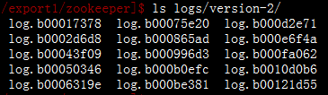

#Zookeeper源码分析(2)

## Zookeeper查看事务日志

zookeeper的事务日志通过zoo.cfg文件中的dataLogDir配置项配置，文件如下

zookeeper提供了查看事务日志的工具类LogFormatter ，运行

    java -classpath .:slf4j-api-1.6.1.jar:zookeeper-3.4.5.jar org.apache.zookeeper.server.LogFormatter /export1/zookeeper/logs/version-2/log.1000003d2 